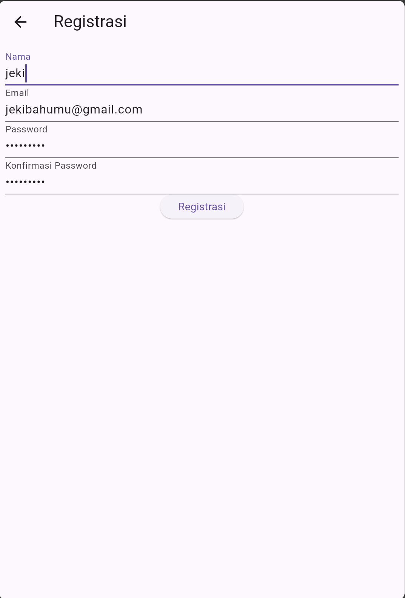
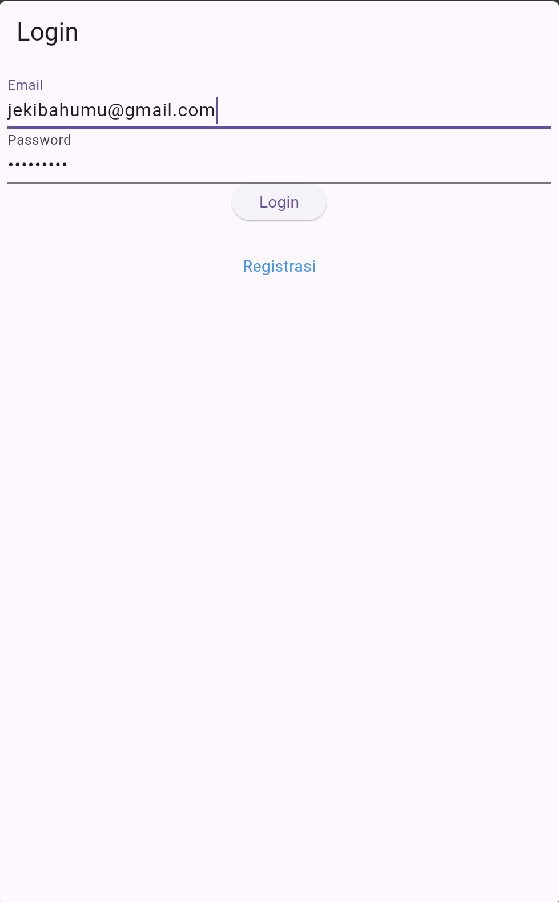
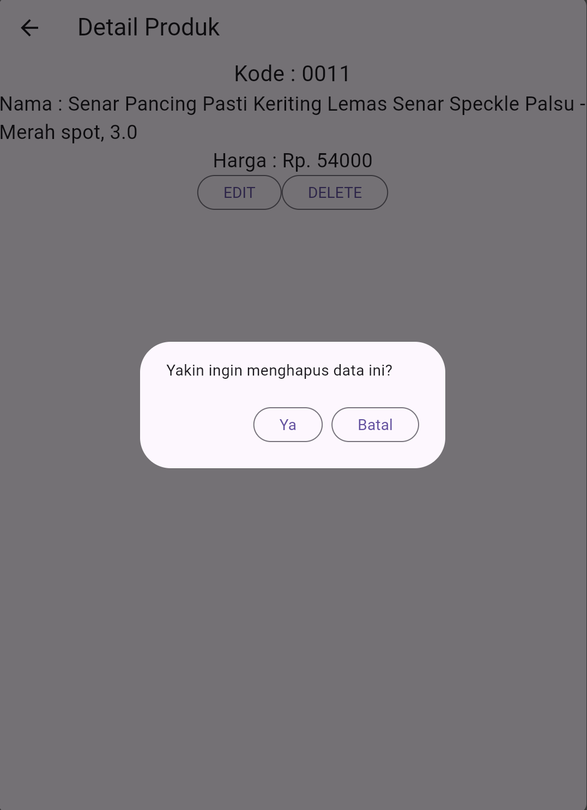

    Nama       : Afiftha Ravi Aufa

    NIM        : H1D022095

    Shift Baru : A

# Tugas Pertemuan 5

## 1. Proses Registrasi dan Login

### a. Registrasi

 
 
 
 Pengguna memasukan Nama, Alamat, password, serta konfirmasi password untuk registrasi

```dart
     Widget _namaTextField() {
      return TextFormField(
      decoration: const InputDecoration(labelText: "Nama"),
      keyboardType: TextInputType.text,
      controller: _namaTextboxController,
      validator: (value) {
        if (value!.length < 3) {
          return "Nama harus diisi minimal 3 karakter";
        }
        return null;
      },
    );
  }

  // Membuat Textbox email
  Widget _emailTextField() {
    return TextFormField(
      decoration: const InputDecoration(labelText: "Email"),
      keyboardType: TextInputType.emailAddress,
      controller: _emailTextboxController,
      validator: (value) {
        // validasi harus diisi
        if (value!.isEmpty) {
          return 'Email harus diisi';
        }
        // validasi email
        Pattern pattern =
            r'^(([^<>()[\]\\.,;:\s@\"]+(\.[^<>()[\]\\.,;:\s@\"]+)*)|(\".+\"))@((\[[0-9]{1,3}\.[0-9]{1,3}\.[0-9]{1,3}\.[0-9]{1,3}\])|(([a-zA-Z\-0-9]+\.)+[a-zA-Z]{2,}))$';
        RegExp regex = RegExp(pattern.toString());
        if (!regex.hasMatch(value)) {
          return "Email tidak valid";
        }
        return null;
      },
    );
  }

  // Membuat Textbox password
  Widget _passwordTextField() {
    return TextFormField(
      decoration: const InputDecoration(labelText: "Password"),
      keyboardType: TextInputType.text,
      obscureText: true,
      controller: _passwordTextboxController,
      validator: (value) {
        // jika karakter yang dimasukkan kurang dari 6 karakter
        if (value!.length < 6) {
          return "Password harus diisi minimal 6 karakter";
        }
        return null;
      },
    );
  } seterusnya..
```

Setelah menekan tombol registrasi, aplikasi akan mengirim data email dan password ke API yang akan menampilkan popup jika registrasi berhasil maupun gagal.

```dart
void _submit() {
    _formKey.currentState!.save();
    setState(() {
      _isLoading = true;
    });
    RegistrasiBloc.registrasi(
      nama: _namaTextboxController.text,
      email: _emailTextboxController.text,
      password: _passwordTextboxController.text,
    ).then((value) {
      if (value['status']) {
        showDialog(
          context: context,
          barrierDismissible: false,
          builder: (BuildContext context) => SuccessDialog(
            description: "Registrasi berhasil, silahkan login",
            okClick: () {
              Navigator.pop(context);
            },
          ),
        );
      } else {
        showDialog(
          context: context,
          barrierDismissible: false,
          builder: (BuildContext context) => WarningDialog(
            description: value['message'],
          ),
        );
      }
    }).catchError((error) {
      showDialog(
        context: context,
        barrierDismissible: false,
        builder: (BuildContext context) => const WarningDialog(
          description: "Registrasi gagal, silahkan coba lagi",
        ),
      );
    }).whenComplete(() {
      setState(() {
        _isLoading = false;
      });
    });
  }
```

### b. Login

  

Melakukan Login ke Halaman Produk dengan akun yang dibuat pada registrasi

```dart
Widget build(BuildContext context) {
 return Scaffold(
   appBar: AppBar(
     title: const Text('Login'),
   ),
   body: SingleChildScrollView(
     child: Padding(
       padding: const EdgeInsets.all(8.0),
       child: Form(
         key: _formKey,
         child: Column(
           children: [
             _emailTextField(),
             _passwordTextField(),
             _buttonLogin(),
             const SizedBox(
               height: 30,
             ),
             _menuRegistrasi(),
           ],
         ),
       ),
     ),
   ),
 );
}
```

jika login tidak berhasil entah dari server atau input email dan password yang salah maka akan menampilkan output "Login gagal, silahkan coba lagi"

```dart
void _submit() {
  _formKey.currentState!.save();
  setState(() {
    _isLoading = true;
  });
  LoginBloc.login(
          email: _emailTextboxController.text,
          password: _passwordTextboxController.text)
      .then((value) async {
    if (value.code == 200) {
      await UserInfo().setToken(value.token.toString());
      await UserInfo().setUserID(int.parse(value.userID.toString()));
      Navigator.pushReplacement(context,
          MaterialPageRoute(builder: (context) => const ProdukPage()));
    } else {
      showDialog(
          context: context,
          barrierDismissible: false,
          builder: (BuildContext context) => const WarningDialog(
                description: "Login gagal, silahkan coba lagi",
              ));
    }
  }, onError: (error) {
    print(error);
    showDialog(
        context: context,
        barrierDismissible: false,
        builder: (BuildContext context) => const WarningDialog(
              description: "Login gagal, silahkan coba lagi",
            ));
  });
}
```

## 2. Halaman Produk

 
tampilan halaman produk setelah login menggunakan akun yang baru di registrasi
 
```dart  
class ProdukPage extends StatefulWidget {
  const ProdukPage({Key? key}) : super(key: key);
  @override
  _ProdukPageState createState() => _ProdukPageState();
}

class \_ProdukPageState extends State<ProdukPage> {
@override
Widget build(BuildContext context) {
return Scaffold(
appBar: AppBar(
title: const Text('List Produk'),
actions: [
Padding(
padding: const EdgeInsets.only(right: 20.0),
child: GestureDetector(
child: const Icon(Icons.add, size: 26.0),
onTap: () async {
Navigator.push(context,
MaterialPageRoute(builder: (context) => ProdukForm()));
},
))
],
),
body: FutureBuilder<List>(
future: ProdukBloc.getProduks(),
builder: (context, snapshot) {
if (snapshot.hasError) print(snapshot.error);
return snapshot.hasData
? ListProduk(
list: snapshot.data,
)
: const Center(
child: CircularProgressIndicator(),
);
},
),
);
}
}

````

## 3. Proses Tambah Data Produk
 
Pada halaman produk tekan ikon "+" maka akan menampilkan form yang digunakan untuk memasukan data produk yang akan ditambah

```dart
Widget _kodeProdukTextField() {
  return TextFormField(
    decoration: const InputDecoration(labelText: "Kode Produk"),
    keyboardType: TextInputType.text,
    controller: _kodeProdukTextboxController,
    validator: (value) {
      if (value!.isEmpty) {
        return "Kode Produk harus diisi";
      }
      return null;
    },
  );
} seterusnya...
````

mengirimkan data yang di input ke api

```dart
simpan() {
  setState(() {
    _isLoading = true;
  });
  Produk createProduk = Produk(id: null);
  createProduk.kodeProduk = _kodeProdukTextboxController.text;
  createProduk.namaProduk = _namaProdukTextboxController.text;
  createProduk.hargaProduk = int.parse(_hargaProdukTextboxController.text);
  ProdukBloc.addProduk(produk: createProduk).then((value) {
    if (value['status']) {
      showDialog(
        context: context,
        barrierDismissible: false,
        builder: (BuildContext context) => SuccessDialog(
          description: "Produk berhasil ditambahkan",
          okClick: () {
            Navigator.of(context).pushReplacement(
              MaterialPageRoute(
                builder: (BuildContext context) => const ProdukPage(),
              ),
            );
          },
        ),
      );
    } else {
      showDialog(
        context: context,
        builder: (BuildContext context) => WarningDialog(
          description: value['message'],
        ),
      );
    }
  }).catchError((error) {
    showDialog(
      context: context,
      builder: (BuildContext context) => const WarningDialog(
        description: "Simpan gagal, silahkan coba lagi",
      ),
    );
  }).whenComplete(() {
    setState(() {
      _isLoading = false;
    });
  });
}
```

maka pada halaman produk, data produk yang ditambahkan akan muncul


## 4. Proses tampil data


  jika nama/bagian dari produk yang sudah dibuat di tekan maka akan menuju ke halaman detail produk

```dart
class ProdukDetail extends StatefulWidget {
  Produk? produk;
  ProdukDetail({Key? key, this.produk}) : super(key: key);
  @override
  _ProdukDetailState createState() => _ProdukDetailState();
}

class _ProdukDetailState extends State<ProdukDetail> {
  @override
  Widget build(BuildContext context) {
    return Scaffold(
      appBar: AppBar(
        title: const Text('Detail Produk'),
      ),
      body: Center(
        child: Column(
          children: [
            Text(
              "Kode : ${widget.produk!.kodeProduk}",
              style: const TextStyle(fontSize: 20.0),
            ),
            Text(
              "Nama : ${widget.produk!.namaProduk}",
              style: const TextStyle(fontSize: 18.0),
            ),
            Text(
              "Harga : Rp. ${widget.produk!.hargaProduk.toString()}",
              style: const TextStyle(fontSize: 18.0),
            ),
            _tombolHapusEdit()
          ],
        ),
      ),
    );
  }

  // ...
}
```

## 5. Proses Edit dan Hapus Data

### a. Edit Produk


Dari halaman detail produk, pengguna dapat menekan tombol "EDIT" untuk membuka form ubah produk.

```dart
Widget build(BuildContext context) {
  return Scaffold(
    appBar: AppBar(
      title: const Text('Detail Produk'),
    ),
    body: Center(
      child: Column(
        children: [
          Text(
            "Kode : ${widget.produk!.kodeProduk}",
            style: const TextStyle(fontSize: 20.0),
          ),
          Text(
            "Nama : ${widget.produk!.namaProduk}",
            style: const TextStyle(fontSize: 18.0),
          ),
          Text(
            "Harga : Rp. ${widget.produk!.hargaProduk.toString()}",
            style: const TextStyle(fontSize: 18.0),
          ),
          _tombolHapusEdit()
        ],
      ),
    ),
  );
}
```

```dart
ubah() {
  setState(() {
    _isLoading = true;
  });
  Produk updateProduk = Produk(id: widget.produk!.id!);
  updateProduk.kodeProduk = _kodeProdukTextboxController.text;
  updateProduk.namaProduk = _namaProdukTextboxController.text;
  updateProduk.hargaProduk = int.parse(_hargaProdukTextboxController.text);
  ProdukBloc.updateProduk(produk: updateProduk).then((value) {
    showDialog(
      context: context,
      barrierDismissible: false,
      builder: (BuildContext context) => SuccessDialog(
        description: "Produk berhasil diubah",
        okClick: () {
          Navigator.of(context).push(
            MaterialPageRoute(
              builder: (BuildContext context) => const ProdukPage(),
            ),
          );
        },
      ),
    );
  }, onError: (error) {
    showDialog(
        context: context,
        builder: (BuildContext context) => const WarningDialog(
              description: "Permintaan ubah data gagal, silahkan coba lagi",
            ));
  });
  setState(() {
    _isLoading = false;
  });
}
```

### b. Hapus Produk



dari halaman detail produk, pengguna dapat menekan tombol "DELETE" untuk menghapus produk dan setelah ditekan akan menampilkan popout konfirmasi apakah yakin akan menghapus data.

```dart
void confirmHapus() {
  AlertDialog alertDialog = AlertDialog(
    content: const Text("Yakin ingin menghapus data ini?"),
    actions: [
      OutlinedButton(
        child: const Text("Ya"),
        onPressed: () async {
          // Proses penghapusan
        },
      ),
      OutlinedButton(
        child: const Text("Batal"),
        onPressed: () => Navigator.pop(context),
      ),
    ],
  );
  showDialog(builder: (context) => alertDialog, context: context);
}
```

kemudian ini untuk bagian request api nya

```dart
onPressed: () async {
  bool success = await ProdukBloc.deleteProduk(
      id: int.parse(widget.produk!.id!));
  if (success) {
    showDialog(
      context: context,
      barrierDismissible: false,
      builder: (BuildContext context) => SuccessDialog(
        description: "Produk berhasil dihapus",
        okClick: () {
          Navigator.of(context).pushReplacement(
            MaterialPageRoute(
              builder: (context) => const ProdukPage(),
            ),
          );
        },
      ),
    );
  } else {
    // Jika penghapusan gagal
    showDialog(
      context: context,
      builder: (BuildContext context) => const WarningDialog(
        description: "Hapus gagal, silahkan coba lagi",
      ),
    );
  }
},
```
